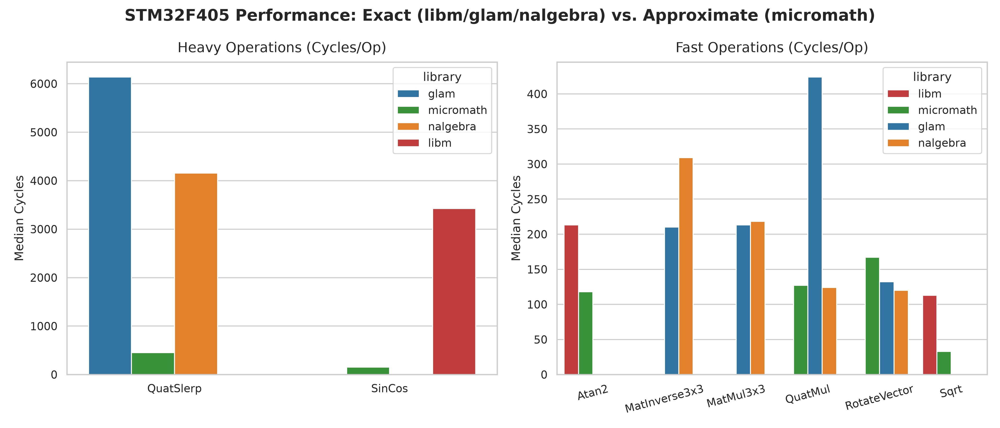

<!-- _class: lead -->
<!-- _paginate: false -->

# C vs Rust on robot MCUs

## Project update 8 July 2026

---

## Reminder: What we're trying to find out

- How do different Rust math libraries perform?
  - glam, nalgebra, libm, micromath
- MCUs: RP2040 (Raspberry Pico 1), STM32 (Crazyflie). More to come.
- Also compare against the crazyflie C math implementation

---

## What makes this complicated

- Number of targets: 3-4
- Number of math libraries: 3-4
- Number of tests: many
  - Tests can be tedious to implement
- Input per single test: 1 to many

---

## How our benchmark setup works

- One JSON lists tests, libraries, repetitions, inputs.
- Build macro turns it into code -> No JSON parsing on target
- Time only actual computation, not preproccessing/logging

---

## Adding a new benchmark task

1. _Define inputs_: Add input struct in `mrs-benchmark-core/src/inputs.rs`
2. _Register task_: Add task type and trait implementation in `mrs-benchmark-core/src/tasks.rs`
3. _Configure dataset_: Add input values and repetitions to `inputs.json`
4. _Implement logic_: Write preparation and evaluation code in desired suite files (`glam.rs`, `nalgebra.rs`, `micromath.rs`)

---

## What it produces currently

- Runs on Pico 1 and STM32
- One CSV row per platform, library, task, and input
- Each row has the timing and the actual result

---

## Some early numbers: STM32F405 Cycles

- Trigonometrics / Sqrt: `micromath` is drastically faster:
  - SinCos: `micromath` (151 cycles) is **22.7x faster** than `libm` (3,427 cycles)
  - Sqrt: `micromath` (33 cycles) is **3.4x faster** than `libm` (113 cycles)
- Quaternion Slerp:
  - `micromath` (452 cycles) is **9x faster** than `nalgebra` (4,155 cycles) and **13.5x faster** than `glam` (6,140 cycles)
- Matrix Inversion 3x3:
  - `glam` (210 cycles) is **1.5x faster** than `nalgebra` (309 cycles)
- Quaternion Multiplication anomaly:
  - `nalgebra` (124 cycles) and `micromath` (127 cycles) are **3.4x faster** than `glam` (424 cycles) on ARM Cortex-M4

---

## STM32 Performance Comparison

---

## The CI pipeline

_Hardware in the loop (HIL)_

- Check: fmt and clippy
- Build: compile binaries
- Run: flash chips over probe and capture output.
- Collect: pull CSV rows from all logs, write combined CSV

---

## Current state

- The full path works: input json runs on chip, creates one CSV
  - For Pico 1, STM32F405, and host native target (x86)
- Flashing and capturing runs locally over ST-Link
- Tasks implemented: Matrix Inversion, Scalar Trigonometry, Quaternion operations
- STM32 isn't connected to CI yet, Pico 2 hasn't been implemented

---

## What's next

- More tests!
- Turn the CSV into charts (on CI too), track runs (maybe MLflow?)
- Measure accuracy (evaluating the result column)
- Pico 2 bring-up
- Standardized reproducible input generation
- Bring in C through Crazyflie firmware?
