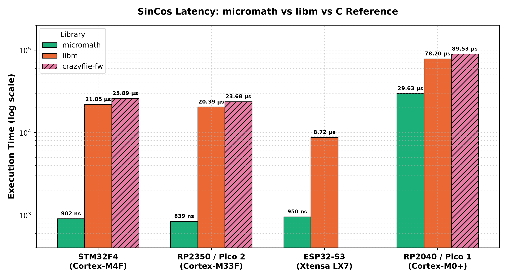
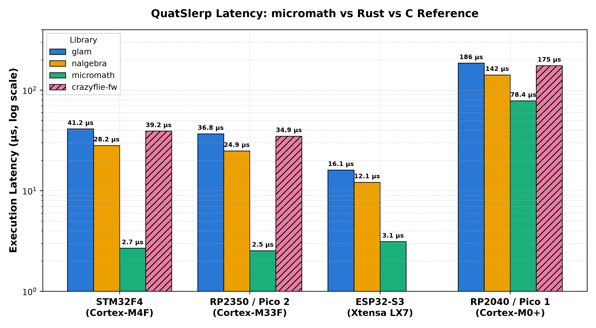
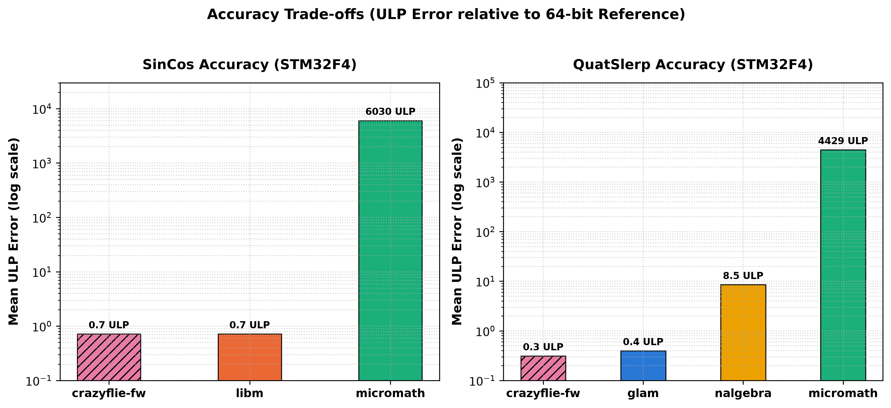
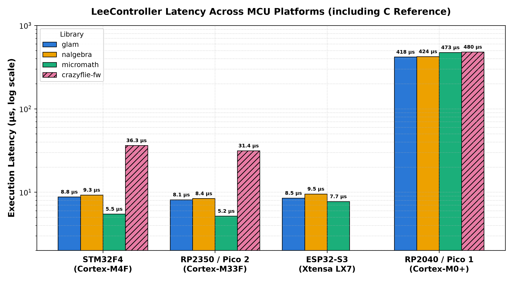
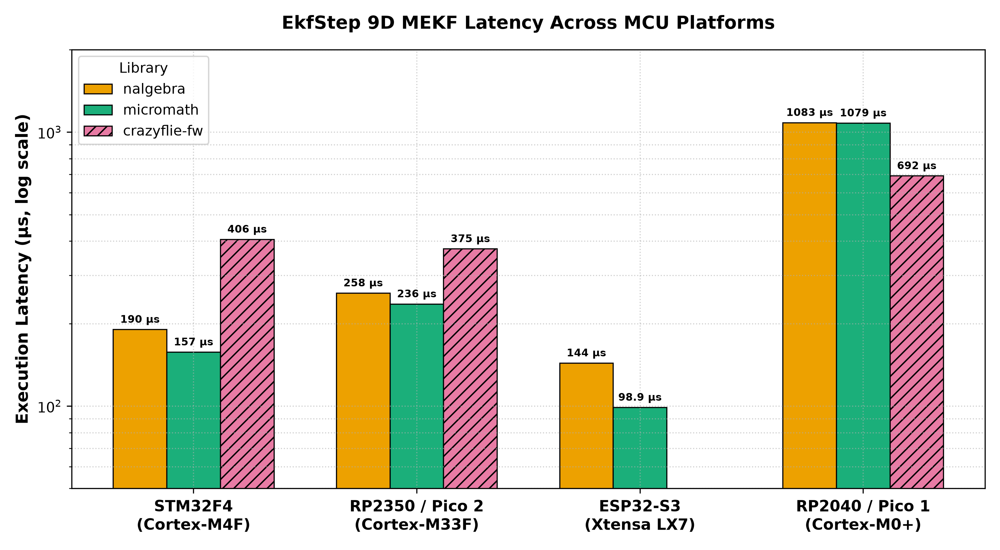
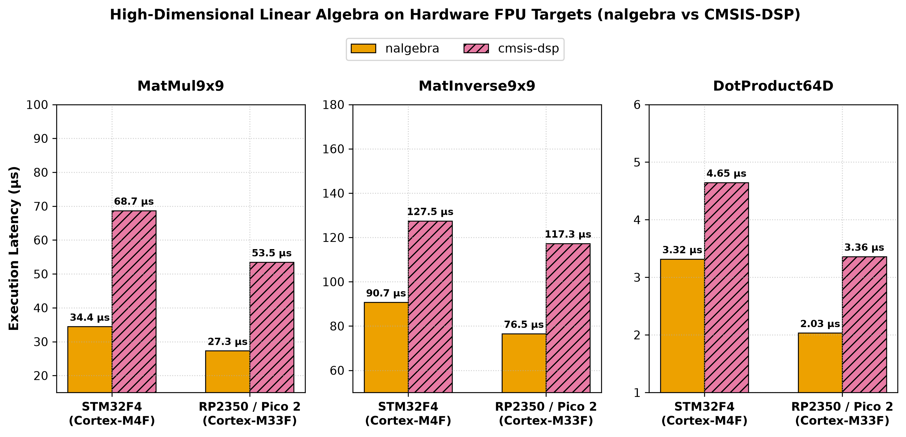

<!-- _class: lead -->
<!-- _paginate: false -->

# C vs Rust on robot MCUs

## Project update 5 August 2026

---

## Quick reminder: what we're doing

- Rust math libraries (glam, nalgebra, micromath) vs C, on real flight-controller-class MCUs
- Still Milestone 1 focus: math library benchmarking

---

## Since the last update (8 Jul)

- ESP32-S3 bring-up: new architecture (Xtensa), now running in CI
- RP2350 / Pico 2 bring-up: now running in CI
- Crazyflie C reference (`crazyflie-fw`) integrated: first real C numbers, not just `libm`
- LeeController: first full-controller task, not an isolated math op
- Extended Kalman Filter (`EkfStep` 9D MEKF) added
- CMSIS-DSP vs `nalgebra` high-dimensional tasks (`MatMul9x9`, `MatInverse9x9`, `DotProduct64D`)
- Automated ULP accuracy evaluation across all libraries and tasks

---

## Platform status

| Platform              | Status                          |
| --------------------- | ------------------------------- |
| host                  | running                         |
| stm32 (Crazyflie MCU) | running                         |
| rp2040 (Pico 1)       | running                         |
| rp2350-arm (Pico 2)   | running (new)                   |
| esp32s3               | running (new)                   |
| nrf52840              | planned (hardware not on hand)  |
| rp2350-riscv (Pico 2) | planned (blocked on `probe-rs`) |

---

## Full CI pipeline done

- Hardware in the Loop
- Automatic code to PDF with plots
- previous `results.csv` now converted to `report.pdf` via matplotlib
- Per-platform pages, plus a by-task comparison section
- Stable "latest main" artifact link

---

## SinCos Latency: micromath vs libm vs C Reference



---

## QuatSlerp Latency: micromath vs Rust vs C Reference



---

## Accuracy Evaluation & ULP Metrics

- **Units in the Last Place (ULP)**: Measures bit-exact numerical discrepancy relative to 64-bit float (`f64`) reference inputs/outputs
- **High-Precision Libraries**: `crazyflie-fw` (0.3–0.7 ULP) and `glam` (0.4 ULP) achieve full single-precision IEEE 754 bit-accuracy
- **Fast-Math Trade-off**: `micromath` achieves 15x–29x speedups using polynomial approximations, sacrificing 3 decimal places of precision (~4,000–6,000 ULP error)

---

## Accuracy Comparison: SinCos & QuatSlerp (ULP Error)



---

## Complex tasks: LeeController & EKF

- **LeeController**: Full 3D geometric position & attitude controller
  - **Libraries**: `glam`, `nalgebra`, `micromath`, `crazyflie-fw` (C reference)
  - **Benchmarked math**: 3D vector ops, SO(3) rotation matrices, cross products, thrust/torque mixing

- **EkfStep**: 9D Multiplicative Extended Kalman Filter (MEKF) prediction & update step
  - **Libraries**: `nalgebra`, `micromath`, `crazyflie-fw` (Bitcraze C Kalman core)
  - **Benchmarked math**: $9 \times 9$ matrix covariance propagation, 3D state integration & measurement updates

---

## LeeController: Cross-Platform Comparison



---

## EKF 9D MEKF Step: Cross-Platform Comparison



---

## ARM Target Benchmark: CMSIS-DSP vs Rust

- **Scope**: High-dimensional math on FPU targets (`STM32F4` Cortex-M4F & `RP2350` Cortex-M33F)
- **Tasks**: `MatMul9x9`, `MatInverse9x9`, and `DotProduct64D`
- **Key Driver**: `nalgebra` fixed-size matrices allow LLVM to unroll loops directly into FPU registers (`s0`–`s31`), avoiding `cmsis-dsp` dynamic struct pointer overhead
- **Result**: `nalgebra` is **1.4x to 2.0x faster** than CMSIS-DSP across all tasks

---

## High-Dimensional Math: nalgebra vs CMSIS-DSP (ARM Targets)



---

## Under the Hood: nalgebra vs CMSIS-DSP Assembly

<table style="font-size: 0.7em; width: 100%; border: none; box-shadow: none;">
<tr style="border: none; background: transparent;">
<td style="width: 50%; vertical-align: top; border: none; padding-right: 15px;">

**`nalgebra` (Static Matrix Unrolling)**

```armasm
    vldr    s0, [r1, #320]
    vldr    s29, [r1, #84]
    vstr    s0, [sp, #248]
    vldr    s2, [r1]
    ...
    vmla.f32 s2, s4, s6
    vmla.f32 s8, s10, s12
    vmla.f32 s14, s16, s18
    ... (988 consecutive vmlas)
```

</td>
<td style="width: 50%; vertical-align: top; border: none; padding-left: 15px;">

**CMSIS-DSP (Dynamic Runtime Structs)**

```armasm
.L_inner_loop:
    vldr    s14, [r4]           
    vldr    s15, [r5]           
    vmla.f32 s13, s14, s15      

    adds    r5, r5, r8
    adds    r4, r4, #4
    subs    r6, r6, #1
    cmp     r6, #0
    bne     .L_inner_loop
```

</td>
</tr>
</table>

---


## AI in the workflow

- `AGENTS.md` / `CLAUDE.md` + memory files: durable context & architecture decisions across sessions
- Claude `superpowers` skills (brainstorming, implementing, systematic-debugging)
  - helps against hallucinating and too verbose code
- Antigravity: interactive pair programming & automated benchmark visualization

---

## What's next

- `nrf52840` bring-up (once hardware is on hand)
- More tasks, broader library coverage
