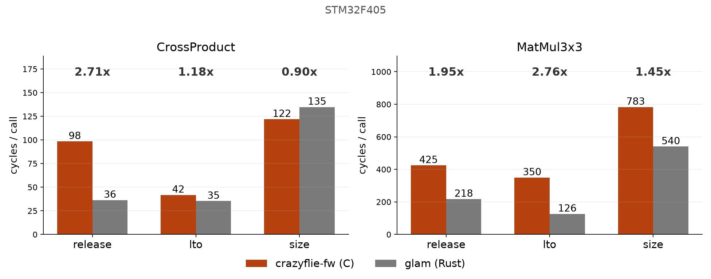
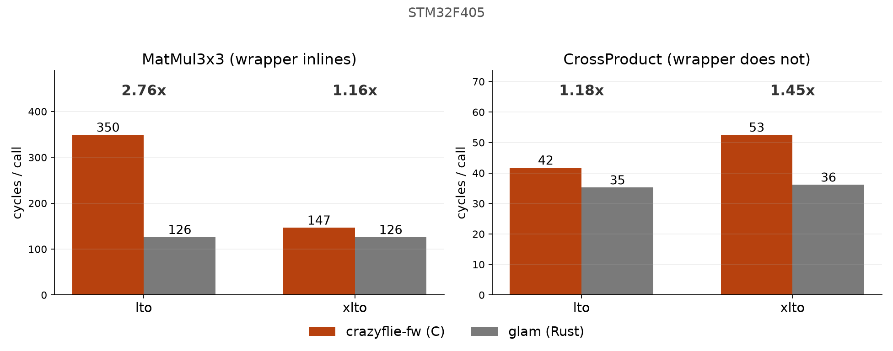

<!-- _class: lead -->
<!-- _paginate: false -->

# C vs Rust on robot MCUs

## Project update 26 August 2026

---

## Quick reminder: what we're doing

- Rust math libraries (glam, nalgebra, micromath) vs C (crazyflie-fw, CMSIS-DSP) on MCUs

---

## Since the last update

Clean up and data validation

- Now comparing different **build profiles** too
- Fixed Bugs that were inflating Rust's lead
- CI speed improved

<!--
Platform matrix unchanged, no new tasks or libraries. All five boards still running in CI.
-->

---

## Profiles are part of the experiment now

`release`, `lto` and `size` build and run on every board, every pipeline.

<!--
LTO gain is not uniform: crazyflie-fw 1.34x median, cmsis-dsp only 1.05x. That is the fingerprint
of removing fixed overhead, and it sets up the next slide.
-->

---

## Chasing that gap found two bugs

- Our FFI wrapper billed `crazyflie-fw` for a function call the real firmware never pays
- The linker was quietly picking Rust's `libm` over C's for some math calls
- Both fixed. Compare C vs Rust at `lto` now, not `release`.

<!--
Wrapper cost: crazyflie's math is static inline, so FFI needs a real wrapper. CrossProduct
2.70x at release, 1.18x at lto; passing mat33 by value (36 bytes) is the actual cost, not the call.
libm mixup: crazyflie-fw and the Rust libm suite reported bit-identical ULP on five functions,
caught by the accuracy pipeline, not timing. Fixed on STM32 and RP2350; RP2040 cannot be, no FPU.
-->

---

## `xlto`: an extra profile, not a default win

Optimises C and Rust together at link time (ARM boards only), so some C calls now inline into the Rust caller.

Wins where it inlines, losses where it does not (14 of 60 pairs regress). `lto` stays our default.

<!--
CI data, stm32, full sweep: 20 of 60 task x library pairs improved >3%, 14 regressed >3%, 26
unchanged. Only 2 of 11 C wrappers actually inline; the rest return a vec or quat by value, and
clang and rustc disagree on the type layout, so LLVM will not even try.
Big wins: EkfStep 2.06x, CMSIS-DSP MatMul9x9 1.88x. Regression example: CrossProduct, crazyflie-fw
itself goes 42 -> 53 cycles, a real loss not just a faster glam. xlto is release-based, so pure-Rust
rows regress too from losing fat LTO (micromath SinCos +31%).
-->

---

## CI was improved to keep pipeline duration low

Three times the builds, and the pipeline stayed similar (~5mins)

- Flashing runs in parallel now
- Faster SWD clock speed
- Which probe is which encoded in CI variables

---

## Dependencies

- glam, nalgebra and crazyflie-firmware bumped
- CMSIS-DSP unpinned from a 2020 version, now our own submodule
- Library versions recorded in CI too

<!--
glam 0.28 -> 0.33.5, nalgebra 0.33 -> 0.35.0, crazyflie-firmware -> 2026.08, CMSIS-DSP v1.17.1.
Crazyflie's own copy had been frozen at 5.7.0 since April 2020.
-->

---

## Paper

**Rust-for-Robotics workshop, IROS 2026.** WIP, 2-4 pages.

Three contributions: Rust vs C in cycles, the hidden FFI cost, and speed against accuracy.

<!--
Intro, methodology and HIL sections drafted. Results and conclusion still open.
Open question for the room: the profile story from today is not in the paper yet, and
contribution 2 (the FFI penalty) cannot be quantified without it. 2.70x at release, 1.18x at lto.
Deadline not confirmed yet.
-->

---

## Next

- Finish the paper
- Then, focus on exploring Rust async framework `embassy` against RTOS scheduling
