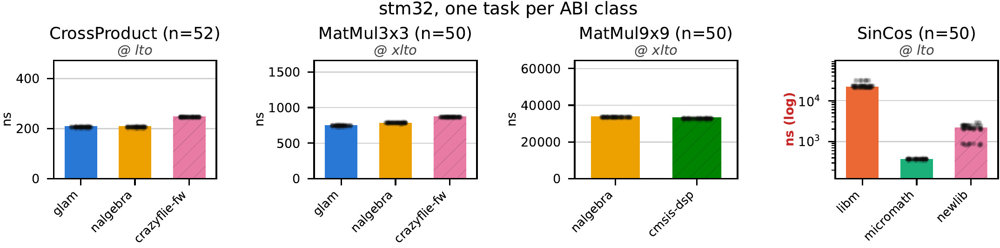
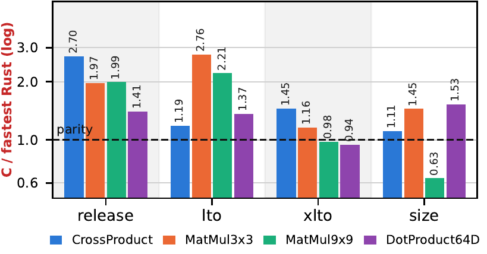
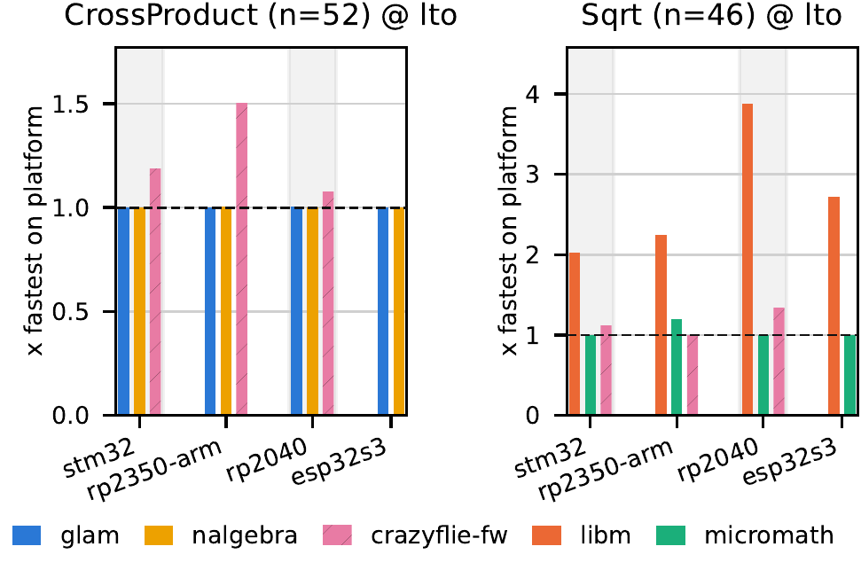

<!-- _class: lead -->
<!-- _paginate: false -->

# C vs Rust on robot MCUs

## Project update 16 September 2026

---

## Quick reminder: what we're doing

- Rust math libraries (glam, nalgebra, micromath) vs C baselines (crazyflie-fw, CMSIS-DSP)
- 20 robotics tasks: vectors, matrices, quaternions, transcendentals, EKF step, Lee controller
- 5 hardware platforms: STM32F405, RP2040, RP2350, ESP32-S3, nRF52840
- Dual evaluation: cycle-accurate execution time + 64-bit ULP numerical accuracy

<!--
Scope recap for context: evaluating whether Rust math libraries are ready for hard real-time
robotics workloads compared to mature C flight-control baselines.
-->

---

## Since the last update

- Paper written, submitted, and **accepted** at IROS 2026 (Rust for Robotics workshop)
- nRF52840 brought up as the fifth hardware target (automated in CI)
- Public repository release on GitHub (`IMRCLab/embedded-math-benchmark-rs`)
- CI fully migrated to GitHub Actions with 7 self-hosted HIL runners

<!--
Task and library set unchanged. Focus since 26 Aug went into finalizing the paper,
bringing up the nRF52840, and the full GitHub/CI migration.
-->

---

## Paper

**Benchmarking Rust and C Math Libraries for Embedded Robotics Applications**

- Rust-for-Robotics workshop, IROS 2026. 4 pages.
- **Accepted** (both reviews: 7 / Good paper, accept)
- Reviewer feedback:
  - Praised disassembly-level root-causing of profile effects
  - Confirmed value of empirical C-vs-Rust baseline for robotics
  - 4-page limit squeezed out figures $\rightarrow$ poster session will showcase them

<!--
Accepted with double 7s. Reviewers singled out the disassembly-level root-causing and
four-profile comparison as the paper's strongest contribution.
-->

---

## Finding 1: the language barely moves the number

Matched calling convention and build profile, Rust linear algebra against the C baselines:

Whole span is 0.94x to 1.47x. glam and nalgebra sit within a few percent of each other.

<!--
"Programming language selection is the weakest predictor of embedded performance." The 2.70x
we used to see on CrossProduct was the release profile leaving Rust-side wrapper scaffolding
un-inlined, plus by-value matrix marshalling billed to C at lto. Read each ABI class at the
profile where both sides get equal compiler treatment: free-ABI at lto, matrix aggregates and
pointer-ABI at xlto. Say which profile with every cross-language number.
-->

---

## Profiles can flip the verdict

- At matched ABI and profile, C and Rust are within ~25%
- But profiles drastically alter the comparison:
  - `lto`: Rust leads `MatMul9x9` by 2.21x (Rust gets fat LTO; C object gets none)
  - `xlto`: Parity (0.98x) via cross-language ThinLTO
  - `size`: C wins at 0.63x (CMSIS-DSP is 1.6x faster on `MatMul9x9`)

---

## Profiles: ratio sensitivity across ABI classes

<!--
Figure 3 from the paper, singled out by Reviewer 1 as the paper's strongest contribution.
Shows C / fastest-Rust across four profiles for one task per ABI class.
Takeaway: anyone quoting a C-vs-Rust number without specifying the profile is likely
measuring compiler configuration artifacts rather than language performance.
-->

---

## Finding 2: the provider decides transcendental cost

- Rust's `libm` crate is ~10x slower on SinCos and 1.8x on Sqrt, but faster on Exp (0.54x), Ln (0.56x), and Atan2 (0.75x)
- **Root cause:** `libm` lacks ARM f32 hardware instructions in several cases; its generic fallback evaluates in `f64`, triggering software emulation on single-precision FPUs
- **Transitive impact:** `glam` and `nalgebra` inherit this penalty on `no_std` via `features = ["libm"]`
- **Takeaway:** Link C `newlib` (or supply hardware f32 routines) for transcendental-heavy loops

---

## Finding 2: transcendental cross-platform comparison

<!--
newlib SinCos 2.15 us, libm crate 21.8 us on the STM32. Sqrt: newlib emits the hardware
vsqrt.f32; the libm crate has no 32-bit ARM backend and falls to a 128-entry table plus
Goldschmidt iterations. glam and nalgebra pull the libm crate in because core has no f32::sqrt,
so the penalty rides into anything with a transcendental inside it: Vec3Normalize's whole glam
deficit is the Sqrt gap, QuatSlerp's 10x is the SinCos gap. RP2040 has no FPU, so there both
sides are software and the comparison changes shape.
-->

---

## Finding 3: fast-math is a real trade

- `micromath` is 5.8x faster than newlib on SinCos (and 2x faster on QuatSlerp)
- **Accuracy cost:** 3 to 6 orders of magnitude precision loss
  - 6,030 mean ULP on SinCos, 120,517 on Sqrt (vs <1 ULP for standard libraries)
  - 1,305 mean ULP on LeeController (vs 0.15 ULP for glam/nalgebra)
- **Open question:** Is this error budget acceptable in flight?
  - We measured open-loop mathematical accuracy, not closed-loop flight dynamics
  - Needs dynamic HIL flight testing to determine whether control stability holds

<!--
Table II in the paper. glam/nalgebra/libm/newlib all stay under ~15 ULP on real inputs.
micromath trades three to six orders of magnitude of precision for speed.
Crucial distinction for the audience: we measured open-loop math ULP, not closed-loop flight stability.
Whether 1,305 ULP on a controller or 6,000 ULP on SinCos destabilizes a physical quadrotor is an
open research question requiring closed-loop HIL flight simulation.
-->

---

## nRF52840 vs STM32: flash architecture matters

- **Same core, identical arithmetic:** Cortex-M4F (FPv4-SP), bit-identical outputs to STM32F405
- **Different cycle counts:** nRF takes 0.9x to 1.6x the STM32's cycles (median ~1.14x slower)
- **Root cause:** Memory subsystem & flash wait states (STM32's ART accelerator hides latency)
- **Landed post-submission:** Listed as future work in the paper; now fully integrated in HIL CI

<!--
Widest gap on branchy libm transcendentals (Exp, Atan2, SinCos) and the size profile, near
zero on tight FPU loops. The point for the room: two identical cores are still not directly
comparable in cycles once the memory subsystem differs. The paper lists nRF52840 as future
work; it landed just after submission. Runs over a standalone J-Link, probe-rs clears the
APPROTECT lock on first contact.
-->

---

## Open-Source Release & CI Migration

- **Public repository:** `github.com/IMRCLab/embedded-math-benchmark-rs`
- **CI migration:** Moved from GitLab pipelines to GitHub Actions
- **New runner setup:** 7 self-hosted runners attached to physical hardware in the lab
  - Same test & benchmark flow as before, now running natively on GitHub Actions

---

## Next

- Finalizing repository and poster for IROS
- Math benchmarking project is mostly done
- Bring up RISC-V core on RP2350 (Pico 2)
- Likely a short exploratory study of Embassy vs FreeRTOS

<!--
With paper acceptance, the core math benchmarking effort is largely wrapped up.
Immediate focus: polish the public GitHub repo and prepare the poster for the workshop.
On hardware: bring up the Hazard3 RISC-V core on the RP2350.
For future scheduling work: keep it to a short, focused exploratory comparison between Embassy and FreeRTOS.
-->
